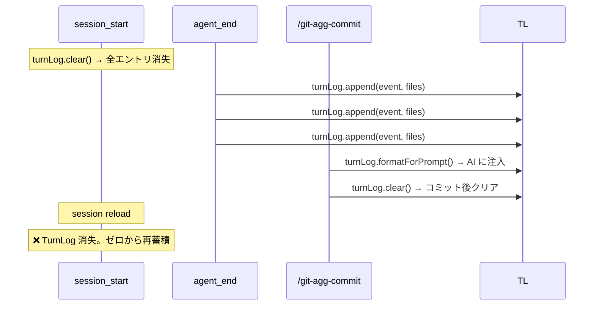

# TurnLog Persistence Plan

> **Date**: 2026-06-13
> **Status**: Reviewed (3 reviewers, all corrections applied)
> **Problem**: TurnLog is in-memory only; disappears on session reload (Ctrl+R, pi restart)

---

## 1. 現状分析

### 1.1 現在の TurnLog ライフサイクル



### 1.2 問題点

- `session_start` で `turnLog.clear()` を呼ぶため、リロードするたびに蓄積コンテキストが消える
- セッション再起動後に `/git-agg-commit` を実行しても、会話コンテキストが空のまま
- AI の Hunk 分割品質が低下する（diff のみの分析にフォールバック）

### 1.3 影響範囲

| コンポーネント | 現在の動作 | 変更後 |
|---------------|-----------|--------|
| `turn-log.ts` | 完全インメモリ | ディスク永続化 + インメモリ |
| `index.ts` | `session_start` で `clear()` | `session_start` で `load()` |
| `batch-committer.ts` | `clear()` 呼び出し | 変更なし（clear が自動でディスク削除） |

---

## 2. 設計

### 2.1 永続化先

```
<git-repo-root>/.pi-git/turn-log.json
```

**選定理由**:
- `.pi-git/` は既に pi-git の永続データ用ディレクトリとして確立済み（旧 `settings.json` の設置先）
- リポジトリローカル → 別リポジトリの TurnLog と混ざらない
- pi 本体の `.pi/` ディレクトリと衝突しない
- `pi-git.toml` と同じリポジトリルートに置くことで、設定とデータの局所性を保つ

> **Note**: `.pi-git/` は設定保存先としては legacy（`pi-git.toml` に移行済み）だが、**運用データ（ランタイムキャッシュ）**の保存先としては引き続き使用する。設定と運用データの分離は意図的であり、`.pi-git/ = 運用データ用ディレクトリ` として再定義する。

### 2.2 ファイルフォーマット

```json
{
  "version": 1,
  "turnIndex": 5,
  "warnNotified": true,
  "entries": [
    {
      "index": 1,
      "userMessage": "ログインフォームを追加して",
      "assistantExcerpt": "login.tsx と api.ts にログインフォームを実装しました",
      "filesChanged": ["src/auth/login.tsx", "src/auth/api.ts"]
    }
  ]
}
```

**フィールド説明**:
- `version`: スキーマバージョン（将来の移行用）。現在は `1` のみ有効
- `turnIndex`: 次に割り当てるターン番号（再起動後も連番を維持）
- `warnNotified`: 警告通知を一度だけ表示するためのフラグ（**永続化する** — 再起動後も表示しないのが意図通り）
- `entries`: TurnEntry の配列（MAX_ENTRIES = 20 制限あり）

### 2.3 TurnLog クラスの変更

```typescript
import {
  existsSync,
  mkdirSync,
  readFileSync,
  renameSync,
  unlinkSync,
  writeFileSync,
} from "node:fs";
import { join } from "node:path";
import { execSync } from "node:child_process";

/** On-disk representation of TurnLog state */
interface PersistedTurnLog {
  version: number;
  turnIndex: number;
  warnNotified: boolean;
  entries: TurnEntry[]; // TurnEntry を export に変更
}

export class TurnLog {
  // ── 既存フィールド ──
  static readonly MAX_ENTRIES = 20;
  static readonly MAX_CHARS = 8_000;
  private entries: TurnEntry[] = [];
  private turnIndex = 0;
  private _warnNotified = false;

  // ── 新規フィールド ──
  private repoRoot: string | null = null; // git rev-parse --show-toplevel

  // ── 新規: 初期化（session_start から同期的に呼ばれる） ──

  /**
   * Initialize TurnLog from persisted state.
   * Synchronous — uses readFileSync to avoid race with agent_end.
   * - Resolves repo root from cwd
   * - Loads turn-log.json if it exists
   * - If not in a git repo, starts fresh (no persistence)
   */
  initialize(cwd: string): void {
    this.repoRoot = this.resolveRepoRoot(cwd);
    if (this.repoRoot) {
      this.loadFromDisk();
    } else {
      // Not in a git repo — start fresh, no persistence
      this.entries = [];
      this.turnIndex = 0;
      this._warnNotified = false;
    }
  }

  // ── 変更: append() — 同期的に保存 ──

  append(event: AgentEndEvent, changedFiles: string[]): void {
    // ... 既存の append ロジック（変更なし） ...

    // 追加: ディスクに同期的に永続化（小さいファイルなので I/O コスト無視可能）
    this.saveToDisk();
  }

  // ── 変更: clear() — ディスクも削除 ──

  clear(): void {
    this.entries = [];
    this.turnIndex = 0;
    this._warnNotified = false;

    // 追加: ディスクのファイルを削除
    this.deleteFromDisk();
  }

  // ── 新規: 永続化メソッド ──

  /**
   * Resolve the git repo root from a working directory.
   * Returns null if not in a git repo.
   * Follows the same pattern as getLocalSettingsPath() in settings.ts.
   */
  private resolveRepoRoot(cwd: string): string | null {
    try {
      return execSync("git rev-parse --show-toplevel", {
        cwd,
        encoding: "utf-8",
        stdio: ["pipe", "pipe", "ignore"],
      }).trim() || null;
    } catch {
      return null;
    }
  }

  /**
   * Load entries from .pi-git/turn-log.json.
   * Synchronous — consistent with loadJson/loadToml in settings.ts.
   */
  private loadFromDisk(): void {
    if (!this.repoRoot) return;

    // Clean up stale temp file from a previous crash
    const tmpPath = join(this.repoRoot, ".pi-git", "turn-log.json.tmp");
    try { unlinkSync(tmpPath); } catch { /* ignore */ }

    const filePath = join(this.repoRoot, ".pi-git", "turn-log.json");
    if (!existsSync(filePath)) return;

    let raw: string;
    try {
      raw = readFileSync(filePath, "utf-8");
    } catch {
      return; // read error → fresh start
    }

    if (!raw.trim()) return; // empty file → fresh start

    let data: unknown;
    try {
      data = JSON.parse(raw);
    } catch {
      console.warn("[pi-git] Failed to parse turn-log.json — starting fresh");
      return;
    }

    // ── Runtime type/shape validation ──
    if (
      typeof data !== "object" ||
      data === null ||
      Array.isArray(data)
    ) {
      console.warn("[pi-git] Invalid turn-log.json shape — starting fresh");
      return;
    }

    const obj = data as Record<string, unknown>;

    // Version check
    if (obj.version !== 1) {
      console.warn(
        `[pi-git] Unsupported turn-log.json version: ${obj.version} — starting fresh`,
      );
      return;
    }

    // Validate entries array
    if (!Array.isArray(obj.entries)) {
      console.warn("[pi-git] turn-log.json entries is not an array — starting fresh");
      return;
    }

    // Validate turnIndex
    if (typeof obj.turnIndex !== "number" || !Number.isFinite(obj.turnIndex)) {
      console.warn("[pi-git] turn-log.json turnIndex is invalid — starting fresh");
      return;
    }

    // Filter valid entries (skip malformed ones gracefully)
    const validEntries: TurnEntry[] = [];
    for (const e of obj.entries) {
      if (
        typeof e === "object" &&
        e !== null &&
        typeof (e as TurnEntry).index === "number" &&
        typeof (e as TurnEntry).userMessage === "string" &&
        typeof (e as TurnEntry).assistantExcerpt === "string" &&
        Array.isArray((e as TurnEntry).filesChanged) &&
        (e as TurnEntry).filesChanged.every((f: unknown) => typeof f === "string")
      ) {
        validEntries.push(e as TurnEntry);
      }
      // Silently skip malformed entries
    }

    this.entries = validEntries.slice(-TurnLog.MAX_ENTRIES);
    this.turnIndex = obj.turnIndex as number;
    this._warnNotified = obj.warnNotified === true;
  }

  /**
   * Write current state to .pi-git/turn-log.json.
   * Uses atomic write (tmp file → rename) to prevent corruption.
   */
  private saveToDisk(): void {
    if (!this.repoRoot) return;

    const dir = join(this.repoRoot, ".pi-git");
    const finalPath = join(dir, "turn-log.json");
    const tmpPath = join(dir, `turn-log.json.${process.pid}.tmp`);

    try {
      mkdirSync(dir, { recursive: true, mode: 0o755 });

      const data: PersistedTurnLog = {
        version: 1,
        turnIndex: this.turnIndex,
        warnNotified: this._warnNotified,
        entries: this.entries,
      };

      writeFileSync(tmpPath, JSON.stringify(data, null, 2) + "\n", "utf-8");
      renameSync(tmpPath, finalPath);
    } catch {
      // Silent — persistence failure is non-fatal
    }
  }

  /**
   * Remove .pi-git/turn-log.json.
   * No-op if the file doesn't exist.
   */
  private deleteFromDisk(): void {
    if (!this.repoRoot) return;

    const filePath = join(this.repoRoot, ".pi-git", "turn-log.json");
    try {
      unlinkSync(filePath);
    } catch {
      // File may not exist — that's fine
    }
  }
}
```

### 2.4 設計上の決定事項

| 決定 | 理由 |
|------|------|
| **同期的 I/O** (`readFileSync`, `writeFileSync`) | ① `settings.ts` の既存パターンと一貫。② `initialize()` を非同期にすると `agent_end` との競合が発生。③ ファイルサイズが小さい（<20KB）ため I/O コスト無視可能。④ debounce 不要 → timer 競合バグゼロ |
| **アトミック書き込み** (`writeFileSync(tmp) → renameSync`) | プロセスクラッシュ時に中途半端なファイルが残らない |
| **tmp ファイル名に PID を含める** (`turn-log.json.${pid}.tmp`) | 複数 pi プロセスの同時書き込み衝突を回避 |
| **`loadFromDisk` で stale tmp 掃除** | クラッシュ後のゴミファイルを自動除去 |
| **ランタイム型バリデーション** | `JSON.parse` は成功するが型が不正なケース（`entries: null`, `turnIndex: "abc"` 等）を防御 |
| **`warnNotified` は永続化する** | 再起動後も同じ警告を再表示しないのが意図通り。警告は「TurnLog が消えるまで 1 回」 |
| **ベストエフォート** | 永続化失敗は常にサイレント。インメモリ動作が正しければそれで十分 |

### 2.5 エラーハンドリング

| シナリオ | 動作 |
|----------|------|
| `.pi-git/turn-log.json` が存在しない | 新規開始（entries = []） |
| JSON のパースに失敗（破損） | `console.warn` 出力、新規開始 |
| JSON の型が不正（`entries: null` など） | `console.warn` 出力、新規開始 |
| バージョン不一致（`version: 999`） | `console.warn` 出力、新規開始 |
| 個別エントリが不正な shape | 当該エントリのみスキップ（他は有効） |
| ディスク書き込み失敗（権限不足など） | サイレントに無視（インメモリ動作は継続） |
| `.pi-git/` がファイルとして存在 | `mkdirSync` が ENOTDIR で失敗 → サイレント無視 |
| git リポジトリ外 | 永続化しない（インメモリのみ） |
| 空のファイル | 新規開始（entries = []） |
| `deleteFromDisk` 時にファイル不在 | 例外をキャッチして無視 |

---

## 3. 呼び出し側の変更

### 3.1 `src/index.ts` — `session_start`

```typescript
// Before:
pi.on("session_start", async (_event, ctx) => {
  try {
    if (ctx.hasUI) {
      turnLog.clear(); // reset from previous session
      footerManager.initialize(pi, ctx.ui, ctx.cwd);
      await recoverOrphanedStashes(pi, ctx);
      await footerManager.refresh();
    }
  } catch { /* ... */ }
});

// After:
pi.on("session_start", async (_event, ctx) => {
  try {
    if (ctx.hasUI) {
      turnLog.initialize(ctx.cwd); // load from disk (synchronous)
      footerManager.initialize(pi, ctx.ui, ctx.cwd);
      await recoverOrphanedStashes(pi, ctx);
      await footerManager.refresh();
    }
  } catch { /* ... */ }
});
```

### 3.2 `src/index.ts` — `agent_end`

変更不要。`turnLog.append()` が内部で自動的に `saveToDisk()` を呼ぶ。

### 3.3 `src/core/batch-committer.ts`

変更不要。`turnLog.clear()` が内部で自動的に `deleteFromDisk()` を呼ぶ。

### 3.4 `src/core/turn-log.ts` — `TurnEntry` を export

```typescript
// Before:
interface TurnEntry { ... }

// After:
export interface TurnEntry { ... }
```

`PersistedTurnLog` の型定義で `entries: TurnEntry[]` を使用するため、`TurnEntry` を export する必要がある。`formatForPrompt()` が内部で使うフィールドのみで、外部から直接アクセスされることはない。

---

## 4. 移行パス

| ステップ | 内容 |
|----------|------|
| 1 | `turn-log.ts` に永続化ロジックを追加（`initialize`, `loadFromDisk`, `saveToDisk`, `deleteFromDisk`, `resolveRepoRoot`） |
| 2 | `TurnEntry` を `export` に変更 |
| 3 | `index.ts` の `session_start` で `clear()` → `initialize(cwd)` に変更 |
| 4 | `.pi-git/turn-log.json` が存在しない場合は従来通り新規開始 → **後方互換性 100%** |
| 5 | README に以下を追記: `.pi-git/` を **ユーザーのプロジェクト** `.gitignore` に追加することを推奨（`turn-log.json` には会話履歴が含まれるためコミット不可） |

**破壊的変更**: なし。既存ユーザーは `.pi-git/turn-log.json` が存在しないため、従来通り空の TurnLog で開始する。

---

## 5. 検討した代替案

| 案 | 却下理由 |
|----|---------|
| **pi 本体のセッション永続化に頼る** | pi のセッション永続化 API は未整備。いつ利用可能になるか不透明 |
| **`~/.config/pi-git/turn-log.json` に保存** | 複数リポジトリで共有されるため不適切。リポジトリローカルであるべき |
| **`pi-git.toml` に TurnLog を埋め込む** | TOML にバイナリ的な会話ログを入れるのは不自然。設定と運用データの分離が望ましい |
| **git notes に保存** | 過剰設計。コミットされていない変更のコンテキストを git object に入れるのは不自然 |
| **sessionStorage / localStorage** | pi は Node.js プロセス。ブラウザ用 API は使用不可 |
| **ローテーティングバックアップ (`turn-log.json.bak`)** | MAX_ENTRIES=20 の小さなファイルのため、破損時の復旧より新規開始の方がシンプル。破損は稀であり、全喪失しても影響は軽微（diff 主軸のため） |

---

## 6. テスト計画

| テストケース | 検証内容 |
|-------------|----------|
| 新規セッション（ファイル不在） | `initialize()` → 空の TurnLog |
| リロード復元 | `append()` 数回 → プロセス再起動 → `initialize()` → エントリ復元 + `turnIndex` 連番維持 |
| コミット後クリア | `/git-agg-commit` → `clear()` → `turn-log.json` が削除される |
| 破損 JSON | 壊れた JSON → `console.warn` + 空の TurnLog で継続 |
| 型不正 JSON | `entries: null`, `turnIndex: "abc"` → `console.warn` + 空の TurnLog |
| 個別エントリ不正 | 配列内の一部エントリが不完全 → 当該エントリのみスキップ、有効なエントリは復元 |
| バージョン不一致 | `version: 999` → `console.warn` + 空の TurnLog |
| git リポジトリ外 | `initialize()` → `repoRoot === null` → インメモリのみ（エラーなし） |
| 書き込み権限なし | `saveToDisk()` → サイレント失敗、インメモリ動作は継続 |
| MAX_ENTRIES 超過 | 21 エントリ目追加 → 先頭が削除、ディスクも 20 エントリに |
| 空ファイル（0 bytes） | `readFileSync` → 空文字列 → 新規開始 |
| `deleteFromDisk()` ファイル不在 | `unlinkSync` が ENOENT → 例外キャッチして無視 |
| `formatForPrompt()` after load | 復元したエントリが正しくプロンプト出力される |
| 特殊文字（改行、Unicode、引用符） | JSON シリアライズ/デシリアライズで文字化けなし |
| `clear()` `deleteFromDisk()` 競合なし | 同期的なため timer 競合は発生しない（設計により不存在） |
| `initialize()` 2 回呼び出し | 2 回目でエントリが重複しない（上書き動作） |

テストフレームワーク: Node.js native test runner（`node --import tsx --test`）。テストファイル: `src/core/turn-log.test.ts`（新規作成）。

---

## 7. 実装順序

1. **`src/core/turn-log.ts`** — `TurnEntry` を `export` に変更、永続化メソッド追加（`initialize`, `resolveRepoRoot`, `loadFromDisk`, `saveToDisk`, `deleteFromDisk`）、`append()` 末尾に `this.saveToDisk()` 追加
2. **`src/index.ts`** — `session_start` で `clear()` → `initialize(cwd)` に変更
3. **`src/core/turn-log.test.ts`** — テスト実装
4. **動作確認** — 手動でリロード後に TurnLog が復元されることを確認
5. **ドキュメント更新** — `docs/accumulate-mode.md` に永続化の説明を追加、`README` に `.gitignore` 推奨設定を追記

---

## 8. レビューでの指摘と対応

| # | レビュワー | 指摘 | 対応 |
|---|-----------|------|------|
| 1 | R1, R2, R3 | debounce (300ms setTimeout) が `clear()` との競合を引き起こす + プロセス終了時のデータ損失リスク | debounce を**削除**。`append()` 末尾で同期的に `saveToDisk()` を直接呼ぶ |
| 2 | R2 | `initialize()` が非同期だと `agent_end` が先に発火してエントリ消失の競合 | `initialize()` を**同期メソッド**に変更（`readFileSync` 使用） |
| 3 | R2 | ロードした JSON の型バリデーションがない（`entries: null` 等で実行時エラー） | `loadFromDisk` に完全な型・shape バリデーションを追加 |
| 4 | R2 | tmp ファイル名が固定（`turn-log.json.tmp`）で複数 pi プロセスが衝突 | tmp ファイル名に `process.pid` を含める |
| 5 | R2 | `execSync` の `stdio` 抑制がない → git エラーが stderr に流出 | `settings.ts` と同様に `stdio: ["pipe", "pipe", "ignore"]` を指定 |
| 6 | R3 | `TurnEntry` が export されていない → `PersistedTurnLog` で型エラー | `TurnEntry` を `export` に変更 |
| 7 | R1 | `saveToDisk` / `loadFromDisk` が `async` 宣言だが中身は同期 I/O | 両メソッドを**同期メソッド**に変更（`async`/`Promise` 削除） |
| 8 | R1 | `.pi-git/` が legacy ディレクトリなのに新データを置く矛盾 | §2.1 に Note を追加: 「`.pi-git/ = 運用データ用ディレクトリ` として再定義」 |
| 9 | R1 | `clear()` → `deleteFromDisk()` の後に古い timer がファイルを再作成する競合 | debounce 削除により解決（timer が存在しない） |
| 10 | R1 | stale `.tmp` ファイルの蓄積 | `loadFromDisk()` 冒頭で `.tmp` ファイルを掃除 |
| 11 | R2 | `.pi-git/` がファイルの場合 `mkdirSync` が ENOTDIR → フィードバックなし | ベストエフォート設計のため許容（plan に明記） |
| 12 | R3 | §7.1 の推奨（B）と最終決定（C）が矛盾 | 矛盾を解消。plan 全体で「`turn-log.ts` 内に直接実装」に統一 |
| 13 | R3 | テストケース不足（空ファイル、特殊文字、`formatForPrompt` 等） | §6 にテストケースを追加 |
